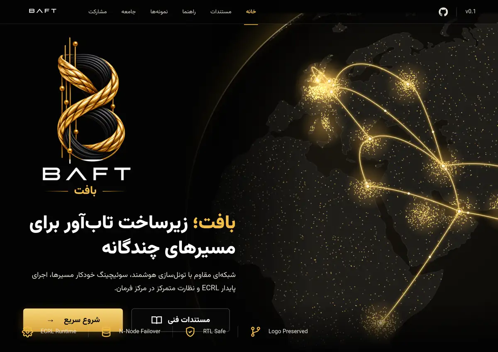

<div dir="rtl" align="right" lang="fa">

<p align="center">
  
</p>

<p align="center">
  <a href="#quick-install"></a>
  &nbsp;
  <a href="docs/fa/README.md"></a>
</p>

<h1 align="center">BAFT — بافت</h1>

<p align="center">
  زیرساخت تاب‌آور برای مسیرهای چندگانه، بازیابی پایدار و کنترل متمرکز مسیرها
</p>

<p align="center" dir="ltr">
  <strong>Bounded · Authenticated · Fail-safe · Transactional</strong>
</p>

<p align="center" dir="ltr">
  <a href="https://github.com/zarkmakerburg/baft/releases/latest"></a>
  <a href="https://github.com/zarkmakerburg/baft/actions/workflows/ci.yml"></a>
  
  
  
  
  
</p>

<p align="center">
  <a href="README.md">English</a> ·
  <a href="https://github.com/zarkmakerburg/baft/releases/latest">آخرین انتشار</a> ·
  <a href="STATUS.md">وضعیت پروژه</a> ·
  <a href="docs/fa/README.md">مستندات فارسی</a>
</p>

---

> **وضعیت پروژه:** BAFT هنوز به‌عنوان نرم‌افزار production-ready اعلام نشده است. هر ادعای عملکرد، امنیت یا بازیابی فقط در محدوده‌ای معتبر است که کد، تست و شواهد CI آن را پشتیبانی کنند.

> **حقوق استفاده:** BAFT نرم‌افزار source-visible و proprietary است. مشاهدهٔ عمومی مخزن به‌معنای اعطای مجوز استفاده، اجرا، کپی، تغییر، توزیع یا ارائهٔ سرویس نیست. جزئیات در [LICENSE](LICENSE) و [COPYRIGHT](COPYRIGHT).

## BAFT چیست؟

BAFT یک **transport fabric کنترل‌شده** برای جابه‌جایی جریان‌های TCP میان نودهای تحت مدیریت همان اپراتور است.

در معماری پایه:

- نود **IR** اتصال Carrier را آغاز می‌کند.
- نود **EX** اتصال را می‌پذیرد.
- دادهٔ برنامه می‌تواند در هر دو جهت منتقل شود.
- peer مقصد دلخواه تعیین نمی‌کند؛ فقط یک **Route ID** مجاز درخواست می‌کند.
- مقصد واقعی از پیکربندی محلی و allowlist همان نود انتخاب می‌شود.

این طراحی عمداً سطح اختیار peer را محدود می‌کند و کنترل مسیر، هویت، Release، Agent و تغییرات عملیاتی را در اختیار اپراتور نگه می‌دارد.

## وضعیت فعلی

**Release رسمی:** [v0.1.0](https://github.com/zarkmakerburg/baft/releases/tag/v0.1.0)

**قابلیت‌های موجود:**

- Release امضاشده با manifest، certificate، revocation list و SHA-256
- Installer با verify اجباری و anti-downgrade
- BCC Control Plane
- Secure Agent با jobهای امضاشده و allowlist
- SSH bootstrap با host-key pinning
- Native Tunnel Builder
- rollback دوطرفه در failure
- Launch-1 end-to-end
- ECRL same-process recovery با bounded replay

**هنوز خارج از محدودهٔ تأییدشده:**

- process-restart resume
- machine-reboot resume
- durable ECRL snapshots
- production readiness
- تضمین سرعت یا اتصال در شبکهٔ عمومی
- ادعای universal undetectability

## معماری

### Control Plane

BCC مسئول مدیریت fleet، صدور jobهای امضاشده، ثبت state، audit و کنترل تغییرات است. Agent روی هر نود فقط actionهای ازپیش‌تعریف‌شده را اجرا می‌کند و مسیر shell آزاد ندارد.

### Data Plane

<div dir="ltr" align="left">

```text
Local Application
       |
       v
IR Route Listener
       |
       v
    BAFT IR
       ||
       || authenticated carrier
       || bounded flow control
       || recovery-aware session
       v
    BAFT EX
       |
       v
Fixed Authorized Route
       |
       v
 Target Service
```

</div>

### اصل Route ثابت

peer اجازه ندارد host/port دلخواه را داخل فریم تعیین کند. IR یک Route ID می‌فرستد و EX مقصد واقعی را از پیکربندی محلی و allowlist خودش انتخاب می‌کند.

## مدل اعتماد

BAFT چند مرز اعتماد را از هم جدا می‌کند:

- هویت Node
- peer allowlist
- Route allowlist
- release trust
- control-plane authorization
- local destination policy

اعتماد به یک CA به‌تنهایی به‌معنای اجازهٔ دسترسی به همه Routeها نیست.

## زنجیرهٔ انتشار امن

Installer فقط artifactهایی را می‌پذیرد که زنجیرهٔ اعتماد Release را پاس کنند:

<div dir="ltr" align="left">

```text
Pinned Root
    |
    v
Release Key Certificate
    |
    +-- not revoked
    +-- valid time window
    v
Signed Manifest
    |
    +-- version
    +-- exact commit
    +-- artifact size
    +-- SHA-256
    v
Downloaded Binaries
```

</div>

اگر verify شکست بخورد، نصب متوقف می‌شود.

## Native Tunnel Builder

ساخت تونل به‌صورت تراکنشی انجام می‌شود:

<div dir="ltr" align="left">

```text
PLAN
  |
  v
VALIDATE
  |
  v
PREPARE EX + PREPARE IR
  |
  v
COMMIT
  |
  v
HEALTH CHECK
  |\
  | \__ failure --> ROLLBACK BOTH SIDES
  |
  +---- success --> ACTIVE
```

</div>

هدف این است که failure میانی، یک سمت را در وضعیت نیمه‌فعال رها نکند.

## BCC — مرکز کنترل BAFT

BCC رابط مدیریتی پروژه است و برای عملیات fleet و tunnel استفاده می‌شود.

قابلیت‌های اصلی:

- دسترسی وب با session و CSRF protection
- rate limit و lock موقت بعد از login failure
- SQLite state
- audit log
- monitoring
- finance ledger
- node revocation
- token rotation
- SSH bootstrap
- Tunnel Builder

هویت بصری BCC در مستند [سیستم بصری BCC](docs/fa/28-bcc-visual-system.md) ثبت شده است؛ **لوگوی اصلی BAFT مستقل از تم BCC باقی می‌ماند و تغییر نمی‌کند.**

<a id="quick-install"></a>

## نصب سریع

### نصب یک‌خطی

روی هر دو سرور همین یک خط را اجرا کنید (Debian/Ubuntu، با دسترسی root):

<div dir="ltr" align="left">

```bash
curl -fsSL https://raw.githubusercontent.com/zarkmakerburg/baft/main/install.sh | sudo bash
```

</div>

نصب‌کننده می‌پرسد سرور کجاست و مراحل همان نقش را دنبال می‌کند:

1. **خارج از ایران (EX)**: اول روی این سرور اجرا کنید. آدرس عمومی را می‌پرسد (آدرس تشخیص‌داده‌شده پیش‌فرض است) و یک pairing code یک‌بارمصرف با پیشوند `BAFTPAIR1:` چاپ می‌کند و منتظر می‌ماند.
2. **داخل ایران (IR)**: همان خط را اجرا کنید و pairing code را وارد کنید. IR راه می‌افتد و یک کد پاسخ با پیشوند `BAFTREPLY1:` چاپ می‌کند.
3. کد پاسخ را در سرور EX وارد کنید. EX راه می‌افتد و تونل برقرار است.

یا بگذارید EX همه‌کار را بکند: روی EX گزینهٔ **راه‌اندازی IR از همین‌جا با SSH** را انتخاب کنید و `user@host` سرور IR و کلید یا رمز آن را بدهید. EX خودش IR را نصب و جفت می‌کند (اول کلید میزبان SSH آن را برای تأیید نشان می‌دهد)، پس اصلاً لازم نیست وارد سرور IR شوید. شرطش این است که SSH از EX به IR باز باشد. در اسکریپت: `--ir-ssh root@IR_HOST --ir-ssh-key FILE --ir-ssh-fingerprint SHA256:...`. با BCC همین کار از داشبورد انجام می‌شود: هر دو سرور را با SSH اضافه کنید و بعد تونل را بسازید ([SSH bootstrap](docs/fa/26-p1d-ssh-bootstrap.md)، [tunnel builder](docs/fa/27-p1e-tunnel-builder.md)).

برای اسکریپت و خودکارسازی می‌توانید پرسش‌ها را با پارامتر رد کنید: `--role ex --public-address EX_HOST_OR_IP` یا `--role ir --pairing-code 'BAFTPAIR1:...'` بعد از `sudo bash -s --`. بدون ترمینال (یا با `BAFT_NONINTERACTIVE=1`) چیزی پرسیده نمی‌شود و `--role` الزامی است.

هر release که installer دریافت می‌کند با کلید ریشهٔ pin‌شده تأیید می‌شود. اگر ترجیح می‌دهید installer را اول بخوانید، روش مرحله‌به‌مرحلهٔ زیر را دنبال کنید.

### دریافت installer

<div dir="ltr" align="left">

```bash
curl -fsSLO https://raw.githubusercontent.com/zarkmakerburg/baft/main/install.sh
less install.sh
chmod +x install.sh
```

</div>

### نصب EX

<div dir="ltr" align="left">

```bash
sudo bash install.sh \
  --role ex \
  --public-address EX_HOST_OR_IP \
  --version v0.1.0
```

</div>

EX یک pairing code با prefix زیر تولید می‌کند:

<div dir="ltr" align="left">

```text
BAFTPAIR1:...
```

</div>

### نصب IR

<div dir="ltr" align="left">

```bash
sudo bash install.sh \
  --role ir \
  --pairing-code 'BAFTPAIR1:...' \
  --version v0.1.0
```

</div>

راهنمای کامل: [اجرای IR و EX](docs/fa/06-running-ir-ex.md)

## ابزارهای اپراتور

<div dir="ltr" align="left">

```bash
sudo baft status
sudo baft doctor
sudo baft logs -n 200 -f
```

</div>

- **status**: نسخه، نقش، peer، Routeها، service state و counterهای recovery
- **doctor**: config، revocation، permissionها، service، release و reachability
- **logs**: دسترسی کنترل‌شده به journal سرویس

## Recovery

در محدودهٔ فعلی، BAFT روی recovery در همان process/session تمرکز دارد.

**تأییدشده:**

- Carrier replacement
- epoch fencing
- bounded replay
- حفظ Flow فعال
- multi-flow continuity
- FIN / FIN_ACK recovery
- commit validation پیش از authority change

**تأییدنشده:**

- resume بعد از restart پردازه
- resume بعد از reboot ماشین
- snapshot پایدار session

## CI و شواهد مهندسی

گیت‌های اصلی پروژه شامل موارد زیر هستند:

- unit / integration tests
- race detector
- `go vet`
- protocol fuzz smoke
- installer E2E
- signed-release installer E2E
- Agent enrollment E2E
- SSH bootstrap روی sshd واقعی
- Launch-1 end-to-end
- rollback tests
- multi-flow / slow-receiver soak
- recovery-specific soak

عبور از این گیت‌ها اثبات correctness در محدودهٔ تست‌شده است و به‌تنهایی به‌معنای benchmark عمومی یا production readiness نیست.

## مستندات مهم

- [معرفی پروژه](docs/fa/01-overview.md)
- [معماری](docs/fa/02-architecture.md)
- [مدل امنیت](docs/fa/03-security-model.md)
- [پروتکل BAFT/1](docs/fa/04-protocol-baft1.md)
- [پیکربندی](docs/fa/05-configuration.md)
- [اجرای IR و EX](docs/fa/06-running-ir-ex.md)
- [تست و CI](docs/fa/08-testing-and-ci.md)
- [Stage D / ECRL](docs/fa/20-stage-d-ecrl.md)
- [Launch-1 Roadmap](docs/fa/22-launch-1-roadmap.md)
- [Signed Releases](docs/fa/23-p1a-signed-releases.md)
- [BCC Access](docs/fa/24-p1c-bcc-access.md)
- [Secure Agent](docs/fa/25-p1d-agent.md)
- [SSH Bootstrap](docs/fa/26-p1d-ssh-bootstrap.md)
- [Tunnel Builder](docs/fa/27-p1e-tunnel-builder.md)
- [سیستم بصری BCC](docs/fa/28-bcc-visual-system.md)

## اسناد وضعیت

- [STATUS.md](STATUS.md)
- [PLAN.md](PLAN.md)
- [TEST-RESULTS.md](TEST-RESULTS.md)
- [KNOWN-LIMITATIONS.md](KNOWN-LIMITATIONS.md)
- [BLOCKERS.md](BLOCKERS.md)

## ساختار مخزن

<div dir="ltr" align="left">

```text
cmd/                 command-line binaries
internal/            runtime, protocol, BCC, agent, recovery
configs/             example configurations
tests/               integration, correctness and E2E tests
scripts/             release/build/test automation
release/             release trust material
docs/fa/             Persian documentation
docs/en/             English documentation
reports/             engineering and research reports
.github/workflows/   CI, soak, release and security workflows
```

</div>

## توسعه از سورس

<div dir="ltr" align="left">

```bash
git clone https://github.com/zarkmakerburg/baft.git
cd baft

go build ./cmd/baft
go test ./...
go test -race ./...
go vet ./...
```

</div>

نسخهٔ مرجع Go در حال حاضر **1.27.1** است.

## چیزی که BAFT نیست

BAFT در وضعیت فعلی:

- VPN عمومی چندکاربره نیست.
- reverse proxy مقصد-دلخواه نیست.
- جایگزین ACL یا PKI سرویس مقصد نیست.
- کیفیت شبکه عمومی را تضمین نمی‌کند.
- universal connectivity یا undetectability را ادعا نمی‌کند.
- process-restart recovery را ارائه نمی‌کند.
- production-ready اعلام نشده است.

## حقوق استفاده

این مخزن **source-visible proprietary software** است.

مشاهده و بررسی عمومی مجاز است؛ استفاده، اجرا، کپی، تغییر، توزیع، میزبانی، ارائهٔ سرویس یا استفاده از نام و لوگوی BAFT بدون مجوز کتبی مجاز نیست.

[LICENSE](LICENSE) · [COPYRIGHT](COPYRIGHT)

---

<p align="center">
  <strong>BAFT</strong><br>
  Bounded · Authenticated · Fail-safe · Transactional
</p>

</div>
