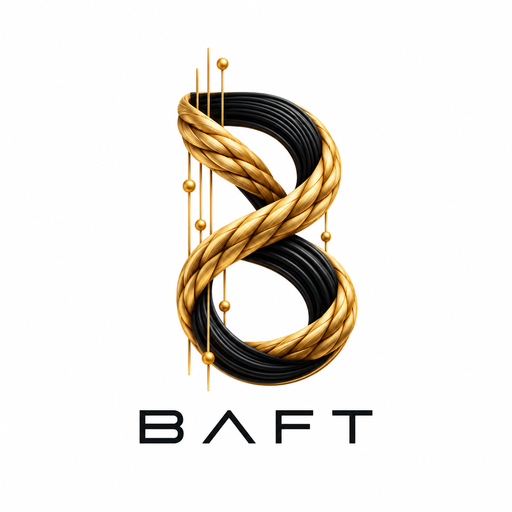

<div dir="rtl" align="right" lang="fa">

<p align="center"></p>

> © 2026 BAFT Project. همهٔ حقوق محفوظ است. این مخزن فقط برای مشاهده عمومی است و هیچ مجوز استفاده‌ای داده نشده است؛ [COPYRIGHT](COPYRIGHT) را ببینید.

# BAFT — بافت

> **زبان:** فارسی | [English](README.en.md)

BAFT یک نرم‌افزار پژوهشی برای انتقال امن و احرازشده‌ی جریان‌های TCP بین دو عامل تحت کنترل همان اپراتور است. در معماری پایه، عامل **IR** اتصال Carrier را به عامل **EX** برقرار می‌کند، اما داده‌ی سرویس در هر دو جهت قابل عبور است. BAFT جای سرویس مقصد، Xray یا برنامه‌ی کاربردی را نمی‌گیرد؛ فقط جریان بایت TCP را میان Routeهای ازپیش‌تعریف‌شده و مجاز جابه‌جا می‌کند.

این مخزن بر پایه‌ی Blueprint محتوایی نسخه 1.4 و Implementation Master Prompt نسخه 1.2 مورخ 2026-09-27 توسعه داده می‌شود. نام تاریخی فایل Blueprint شامل `v1.0` است، اما **نسخه محتوایی مرجع 1.4** است.

## وضعیت پروژه

BAFT هنوز نرم‌افزار پژوهشی است و برای استقرار عمومی یا تولیدی آماده اعلام نشده است.

- **مرحله A:** قراردادها، parser، پیکربندی، PKI آزمایشی و Carrier مبتنی بر HTTP/2 + mTLS پیاده و آزموده شده‌اند.
- **مرحله B:** مسیر عمودی امن TCP → BAFT → TCP، احراز هویت، Route مجاز، Flow، کنترل خطا، ابطال فعال peer، CLI و آزمون COR-01 یک GiB پیاده شده است.
- **مرحله C:** allocator حافظه، backpressure، DRR، صف کنترل محدود و آزمون چند Flow در حال تثبیت هستند.
- **مرحله D و بعد از آن:** resume، epoch fencing، replay، tombstone، benchmark رسمی، عملیات، پژوهش و پایلوت واقعی هنوز کامل نشده‌اند.

وضعیت دقیق و لحظه‌ای را در [STATUS.md](STATUS.md)، برنامه را در [PLAN.md](PLAN.md) و محدودیت‌ها را در [KNOWN-LIMITATIONS.md](KNOWN-LIMITATIONS.md) ببینید.

## BAFT دقیقاً چه مسئله‌ای را حل می‌کند؟

فرض کنید روی سرور IR یک برنامه محلی باید به یک سرویس مشخص در EX دسترسی TCP داشته باشد. به‌جای اینکه peer بتواند هر مقصدی را دلخواه اعلام کند، اپراتور از قبل یک Route مانند `service-main` تعریف می‌کند:

<div dir="ltr" align="left">

```text
برنامه محلی
    │
    ▼
127.0.0.1:1443 روی IR
    │
    ▼
BAFT IR (dialer)
    │
    │  HTTP/2 + TLS 1.3 + mTLS
    │  چند Shard مستقل
    ▼
BAFT EX (listener)
    │
    ▼
Route ثابت و مجاز: 127.0.0.1:2443
    │
    ▼
سرویس مقصد
```

</div>

Peer فقط `route_id` را درخواست می‌کند. مقصد نهایی از جدول Route محلی EX گرفته می‌شود و از داخل فریم شبکه مقصد دلخواه پذیرفته نمی‌شود.

## مفاهیم اصلی

| واژه | معنی |
|---|---|
| **Node** | یک عامل BAFT با نقش `dialer` یا `listener` |
| **IR** | عامل سمت آغازکننده Carrier در معماری پایه |
| **EX** | عامل سمت پذیرنده Carrier در معماری پایه |
| **Carrier** | جریان بایتی احرازشده‌ای که فریم‌های BAFT داخل آن عبور می‌کنند |
| **Shard** | یک Carrier مستقل با مجموعه محدود Flowها و صف‌بندی مستقل |
| **Session** | وضعیت حافظه‌ای BAFT مربوط به یک Shard |
| **Flow** | یک اتصال TCP کاربردی دوطرفه |
| **Route** | نگاشت نام ثابت به listener یا مقصد ازپیش‌مجاز |
| **ACK** | تأیید پذیرش پیوسته داده در BAFT؛ نه تضمین پردازش نهایی برنامه مقصد |
| **WINDOW / Credit** | حد مطلق offset که فرستنده اجازه دارد تا آن بایت ارسال کند |
| **Replay** | داده‌ای که برای بازیابی یا تأیید هنوز باید در حافظه نگه داشته شود |
| **Epoch** | نسل Carrier برای جلوگیری از فعال‌ماندن Carrier قدیمی در resume آینده |

فرهنگ واژگان کامل در [docs/fa/11-glossary.md](docs/fa/11-glossary.md) است.

## اصول امنیتی غیرقابل‌مذاکره

BAFT در مسیر پایه این قواعد را رعایت می‌کند:

- TLS حداقل نسخه 1.3 و mTLS اجباری است.
- plaintext fallback وجود ندارد.
- بررسی chain، hostname، زمان اعتبار و EKU گواهی فعال است.
- هویت Node از گواهی تأییدشده و URI SAN استخراج می‌شود؛ `node_id` داخل HELLO به‌تنهایی اعتماد ایجاد نمی‌کند.
- اعتماد به CA با مجوز Route یکی نیست؛ peer و Route allowlist مستقل دارند.
- مقصد دلخواه از peer یا API پذیرفته نمی‌شود.
- parser قبل از تخصیص حافظه طول و نوع فریم را محدود می‌کند.
- payload کاربر در log یا support bundle قرار نمی‌گیرد.
- نتیجه تست و benchmark فقط از اجرای واقعی ثبت می‌شود.
- هیچ ادعای «غیرقابل‌تشخیص بودن»، «عبور تضمینی در هر شرایط» یا «سرعت تضمینی اینترنت» مطرح نمی‌شود.

جزئیات: [مدل امنیت](docs/fa/03-security-model.md).

## معماری پایه

Carrier پایه روی HTTP/2 واقعی قرار دارد:

<div dir="ltr" align="left">

```text
IR Node
  ├─ Shard 0 ─ TCP/TLS ─ H2 POST ─┐
  ├─ Shard 1 ─ TCP/TLS ─ H2 POST ─┤
  ├─ Shard 2 ─ TCP/TLS ─ H2 POST ─┤──► EX Node
  └─ Shard 3 ─ TCP/TLS ─ H2 POST ─┘

داخل هر Carrier:
HELLO → HELLO_ACK → READY
                  │
                  ├─ OPEN / OPEN_OK
                  ├─ DATA
                  ├─ ACK
                  ├─ WINDOW
                  ├─ FIN / FIN_ACK
                  └─ RESET
```

</div>

هر Shard در baseline مالک Transport مستقل است تا چهار Shard به‌طور تصادفی روی یک اتصال TCP واحد تجمیع نشوند.

## روش توسعه و نوآوری

از این مرحله به بعد، هر تصمیم مهم در BAFT با دو مسیر روشن بررسی می‌شود:

1. **مسیر پایه:** کمینه‌ی امن، محدود، قابل‌آزمون و دارای rollback؛
2. **مسیر پژوهشی:** راهکار ابداعی برای یک خلأ مشخص، همراه با فرضیه‌ی ابطال‌پذیر، prior-art review و معیار شکست.

یک ایده فقط به‌خاطر پیچیده‌تر بودن «نوآوری» محسوب نمی‌شود. برای هر ایده باید روشن باشد چه ضعف شناخته‌شده‌ای را هدف می‌گیرد، تفاوت مفهومی آن چیست، چگونه آزمایش می‌شود و چه ریسک یا هزینه‌ای دارد.

قاعده‌ی ۱۰x/۱۰۰x در این پروژه **فشار طراحی** است، نه ادعای عددی. هیچ برتری عملکردی تا قبل از benchmark مستقل و تکرارپذیر اعلام نمی‌شود.

سه سطح ادعا از هم جدا نگه داشته می‌شوند:

- **فرضیه پژوهشی:** ایده و آزمایش تعریف شده‌اند؛
- **نتیجه مهندسی پشتیبانی‌شده:** کد و CI/آزمایش واقعی از آن پشتیبانی می‌کنند؛
- **novelty یا patentability:** فقط پس از بررسی جدی prior art و ارزیابی تخصصی حقوقی قابل طرح است.

نمونه‌های فعلی:

- [TWRL — دفتر سه‌نشانگر دریافت](docs/fa/13-stage-c-twrl.md): نتیجه مهندسی پشتیبانی‌شده در CI؛
- [PADL — زمان‌بندی deficit فشارمحور با aging](docs/fa/14-stage-c-padl.md): فرضیه پژوهشی در حال ارزیابی.

شرح کامل قواعد: [روش‌شناسی نوآوری](docs/fa/12-innovation-method.md).

## شروع سریع برای توسعه

### 1. پیش‌نیاز

نسخه Go از خود مخزن خوانده می‌شود:

<div dir="ltr" align="left">

```bash
cat go.mod
```

</div>

در حال حاضر پروژه روی Go 1.27.1 تنظیم شده است.

### 2. دریافت و ساخت

<div dir="ltr" align="left">

```bash
git clone https://github.com/zarkmakerburg/baft.git
cd baft
go build ./cmd/baft
```

</div>

### 3. اجرای آزمون‌ها

<div dir="ltr" align="left">

```bash
go test ./...
go test -race ./...
go vet ./...
```

</div>

آزمون COR-01 یک GiB workflow جدا دارد و برای هر اجرای عادی محلی فعال نیست.

### 4. اعتبارسنجی پیکربندی

<div dir="ltr" align="left">

```bash
./baft config validate --file configs/example-ir.yaml
./baft config validate --file configs/example-ex.yaml
```

</div>

این دستور فقط ساختار و قوانین پیکربندی را بررسی می‌کند؛ وجود واقعی فایل‌های گواهی برای فرمان `run` لازم است.

### 5. اجرای Node

پس از ایجاد PKI مناسب و اصلاح آدرس‌ها:

روی EX:

<div dir="ltr" align="left">

```bash
./baft run --file /etc/baft/ex.yaml
```

</div>

روی IR:

<div dir="ltr" align="left">

```bash
./baft run --file /etc/baft/ir.yaml
```

</div>

کلید خصوصی باید دسترسی محدود داشته باشد؛ Runtime فایل کلیدی که برای group/other قابل خواندن یا نوشتن باشد رد می‌کند.

## نمونه Route

IR:

<div dir="ltr" align="left">

```yaml
routes:
  - id: service-main
    listen: 127.0.0.1:1443
    remote_route: service-main
    direction: outbound
    traffic_class: interactive
```

</div>

EX:

<div dir="ltr" align="left">

```yaml
routes:
  - id: service-main
    direction: inbound
    target: 127.0.0.1:2443
    allowed_peers:
      - urn:baft:node:ir-01
```

</div>

در این مثال اتصال به `127.0.0.1:1443` روی IR فقط به Route نام‌گذاری‌شده `service-main` نگاشت می‌شود و EX مقصد واقعی را از پیکربندی محلی خودش می‌خواند.

## نقشه مستندات

اگر اولین بار است پروژه را می‌خوانید، این ترتیب پیشنهاد می‌شود:

1. [معرفی و هدف](docs/fa/01-overview.md)
2. [معماری و جریان داده](docs/fa/02-architecture.md)
3. [مدل امنیت و اعتماد](docs/fa/03-security-model.md)
4. [پروتکل BAFT/1](docs/fa/04-protocol-baft1.md)
5. [پیکربندی](docs/fa/05-configuration.md)
6. [اجرای IR و EX](docs/fa/06-running-ir-ex.md)
7. [کنترل منابع و زمان‌بندی](docs/fa/07-resource-control.md)
8. [تست، CI و معیار پذیرش](docs/fa/08-testing-and-ci.md)
9. [نقشه راه](docs/fa/09-roadmap.md)
10. [ساختار مخزن](docs/fa/10-repository-layout.md)
11. [فرهنگ واژگان](docs/fa/11-glossary.md)
12. [روش‌شناسی نوآوری](docs/fa/12-innovation-method.md)
13. [TWRL در Stage C](docs/fa/13-stage-c-twrl.md)
14. [PADL در Stage C](docs/fa/14-stage-c-padl.md)

نسخه انگلیسی همین مجموعه از [docs/en/README.md](docs/en/README.md) در دسترس است.

## مرجع وضعیت و شواهد

- [STATUS.md](STATUS.md): وضعیت واقعی پیاده‌سازی
- [PLAN.md](PLAN.md): مراحل و گیت‌های باقی‌مانده
- [TEST-RESULTS.md](TEST-RESULTS.md): شواهد آزمون و محیط اجرا
- [KNOWN-LIMITATIONS.md](KNOWN-LIMITATIONS.md): محدودیت‌های شناخته‌شده
- [BLOCKERS.md](BLOCKERS.md): موانع و موارد رفع‌شده
- [dependency-lock.md](dependency-lock.md): وابستگی‌های pin‌شده و checksum
- [docs/adr](docs/adr): تصمیم‌های معماری
- [docs/protocol](docs/protocol): یادداشت‌ها و بردارهای طلایی پروتکل

## چیزی که BAFT نیست

BAFT در وضعیت فعلی:

- VPN عمومی یا سرویس چندمستاجره نیست.
- reverse proxy مقصد-دلخواه نیست.
- جایگزین PKI، ACL یا امنیت سرویس مقصد نیست.
- persistence روی دیسک برای payload کاربر ندارد.
- resume بین restart دو Process را هنوز پشتیبانی نمی‌کند.
- H3، relay و Worker را در مسیر پایه فعال نمی‌کند.
- هیچ تضمینی برای کیفیت یا دسترس‌پذیری شبکه عمومی ارائه نمی‌کند.

## مجوز و مشارکت

پیش از هر مشارکت، ابتدا Blueprint، ADRهای مرتبط و تست‌های همان بخش را بخوانید. تغییرات امنیتی، wire protocol و resource limits باید همراه با تست و توضیح تصمیم باشند. نتیجه‌ای که اجرا نشده نباید در STATUS یا TEST-RESULTS به‌عنوان موفق ثبت شود.

</div>
