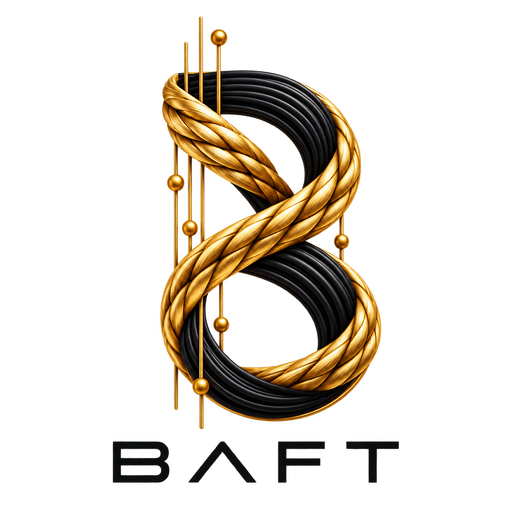
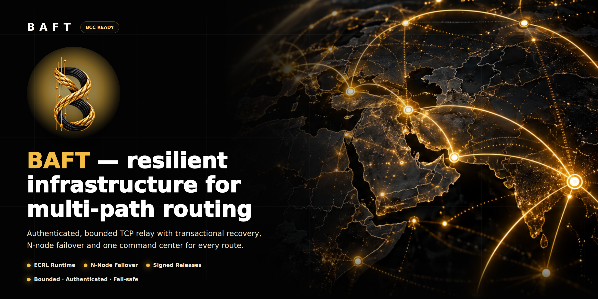

<p align="center">
  
</p>

<p align="center">
  
</p>

<h1 align="center">BAFT</h1>

<p align="center"><strong>Bounded · Authenticated · Fail-safe · Transactional</strong></p>

<p align="center">
  <a href="https://github.com/zarkmakerburg/baft/releases/latest"></a>
  <a href="https://github.com/zarkmakerburg/baft/actions/workflows/ci.yml"></a>
  
  
</p>

<p align="center">
  <a href="README.fa.md">فارسی</a> ·
  <a href="https://github.com/zarkmakerburg/baft/releases/latest">Latest release</a> ·
  <a href="STATUS.en.md">Project status</a> ·
  <a href="docs/en/README.md">Documentation</a>
</p>

> © 2026 BAFT Project. All rights reserved. This repository is public for review only; no license is granted. See [COPYRIGHT](COPYRIGHT).

BAFT is research software for securely relaying authenticated TCP byte streams between two operator-controlled agents. In the baseline architecture the **IR** agent initiates the Carrier connection to **EX**, while application data remains bidirectional. BAFT does not replace the target service, Xray, or the application protocol; it moves TCP bytes only through preconfigured, explicitly authorized Routes.

The repository is developed from content Blueprint v1.4 and Implementation Master Prompt v1.2 dated 2026-09-27. The historical Blueprint filename contains `v1.0`, but the normative content version is **1.4**.

## Project status

BAFT is not declared production-ready.

- **Stage A:** protocol contracts, parser, configuration, test PKI, and the HTTP/2+mTLS Carrier spike are implemented and tested.
- **Stage B:** the secure TCP → BAFT → TCP vertical slice, peer authorization, Routes, Flow semantics, active revocation, CLI, and the 1 GiB COR-01 correctness gate are implemented.
- **Stage C:** global memory allocation, backpressure, byte-based DRR, bounded control scheduling, and multi-Flow testing are being stabilized.
- **Stage D and later:** resume, epoch fencing, replay, tombstones, formal benchmarking, operations, research gates, and real-server pilot work are not complete.

See [STATUS.en.md](STATUS.en.md), [PLAN.en.md](PLAN.en.md), and [KNOWN-LIMITATIONS.en.md](KNOWN-LIMITATIONS.en.md).

## What problem does BAFT solve?

A local service on IR can be mapped to one fixed, pre-authorized service on EX without allowing a peer to provide an arbitrary destination:

```text
local application
      │
      ▼
127.0.0.1:1443 on IR
      │
      ▼
BAFT IR (dialer)
      │
      │ HTTP/2 + TLS 1.3 + mTLS
      │ independent Shards
      ▼
BAFT EX (listener)
      │
      ▼
fixed authorized Route: 127.0.0.1:2443
      │
      ▼
target service
```

OPEN carries a `route_id`, not a target host supplied by the remote peer.

## Core terminology

| Term | Meaning |
|---|---|
| Node | BAFT process acting as `dialer` or `listener` |
| IR | baseline Carrier initiator |
| EX | baseline Carrier listener |
| Carrier | authenticated bidirectional byte stream that transports BAFT frames |
| Shard | independent Carrier with a bounded subset of Flows and its own scheduling |
| Session | in-memory state associated with one Shard |
| Flow | one bidirectional application TCP connection |
| Route | pre-authorized mapping between a local listener and a fixed target |
| ACK | contiguous byte acceptance by BAFT, not proof of final application processing |
| WINDOW / Credit | absolute maximum offset a sender may transmit |
| Replay | unacknowledged bytes retained for recovery semantics |
| Epoch | Carrier generation used by the future resume design |

See [docs/en/11-glossary.md](docs/en/11-glossary.md).

## Non-negotiable security properties

- TLS 1.3 minimum and mTLS are mandatory.
- There is no plaintext fallback.
- Certificate chain, hostname, validity time, and EKU verification stay enabled.
- Node identity is derived from a verified URI SAN; HELLO `node_id` alone does not establish trust.
- CA trust and Route authorization are separate.
- The peer cannot supply an arbitrary target destination.
- Frame sizes and types are validated before allocation.
- User payload is not written to logs or support bundles.
- Test and benchmark claims must come from real executions.
- The project does not claim universal undetectability, guaranteed connectivity, or guaranteed public-network throughput.

Read [Security model](docs/en/03-security-model.md).

## Baseline architecture

```text
IR Node
  ├─ Shard 0 ─ TCP/TLS ─ H2 POST ─┐
  ├─ Shard 1 ─ TCP/TLS ─ H2 POST ─┤
  ├─ Shard 2 ─ TCP/TLS ─ H2 POST ─┤──► EX Node
  └─ Shard 3 ─ TCP/TLS ─ H2 POST ─┘

Inside a Carrier:
HELLO → HELLO_ACK → READY
                  │
                  ├─ OPEN / OPEN_OK
                  ├─ DATA
                  ├─ ACK
                  ├─ WINDOW
                  ├─ FIN / FIN_ACK
                  └─ RESET
```

Each Shard owns an independent transport in the baseline so multiple Shards are not silently pooled onto one TCP connection.

## Innovation and development method

Important BAFT decisions are evaluated on two explicit tracks:

1. **Baseline:** the smallest secure, bounded, testable mechanism with a rollback path.
2. **Research:** a conceptually distinct mechanism aimed at a documented gap, with falsifiable experiments and explicit failure criteria.

The 10x/100x rule is used as design pressure, not as a numeric claim. Research hypotheses, engineering results, and legal novelty/patentability are recorded as separate states.

Current examples:

- [TWRL — Tri-Watermark Receive Ledger](docs/en/13-stage-c-twrl.md): engineering result supported in CI.
- [PADL — Pressure-Aged Deficit Leasing](docs/en/14-stage-c-padl.md): research hypothesis under evaluation.

See [Innovation methodology](docs/en/12-innovation-method.md).

## Developer quick start

```bash
git clone https://github.com/zarkmakerburg/baft.git
cd baft
go build ./cmd/baft

go test ./...
go test -race ./...
go vet ./...
```

The repository currently targets Go 1.27.1 via `go.mod`.

Validate configuration:

```bash
./baft config validate --file configs/example-ir.yaml
./baft config validate --file configs/example-ex.yaml
```

After creating appropriate PKI material and adjusting addresses:

```bash
# EX
./baft run --file /etc/baft/ex.yaml

# IR
./baft run --file /etc/baft/ir.yaml
```

## Documentation map

1. [Overview and goals](docs/en/01-overview.md)
2. [Architecture and data flow](docs/en/02-architecture.md)
3. [Security model](docs/en/03-security-model.md)
4. [BAFT/1 protocol](docs/en/04-protocol-baft1.md)
5. [Configuration](docs/en/05-configuration.md)
6. [Running IR and EX](docs/en/06-running-ir-ex.md)
7. [Resource control and scheduling](docs/en/07-resource-control.md)
8. [Testing and CI](docs/en/08-testing-and-ci.md)
9. [Roadmap](docs/en/09-roadmap.md)
10. [Repository layout](docs/en/10-repository-layout.md)
11. [Glossary](docs/en/11-glossary.md)
12. [Innovation methodology](docs/en/12-innovation-method.md)
13. [Stage-C TWRL](docs/en/13-stage-c-twrl.md)
14. [Stage-C PADL](docs/en/14-stage-c-padl.md)

## What BAFT is not

At the current stage BAFT is not a general-purpose VPN, arbitrary-destination reverse proxy, persistence layer for user payloads, or a finished recovery system. H3, relay, Worker, and real-path research remain outside the default core path until their later gates are explicitly implemented and tested.
