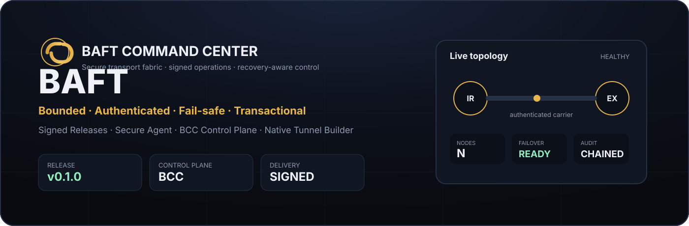

<div dir="rtl" align="right" lang="fa">

# BAFT BCC Visual System

این فایل مرجع هویت بصری رابط BAFT Command Center است. تم کلی BCC باید با صفحهٔ اصلی BAFT هماهنگ باشد: پس‌زمینهٔ مشکی عمیق، طلایی گرم، کنتراست بالا، کارت‌های متراکم و RTL تمیز.

<p align="center">
  
</p>

> نکته: این سیستم بصری جایگزین لوگوی اصلی BAFT نیست. لوگوی رسمی باید بدون بازطراحی و بدون دستکاری در `docs/assets/baft-logo-transparent.png` باقی بماند.

## رنگ‌های پایه

<div dir="ltr" align="left">

```text
Background        #030303
Surface           #090909
Panel             #0b0b0c
Card              #11100d
Input / inset     #050505
Border            #2f2819
Border strong     #5b4319
Primary text      #ffffff
Warm text         #fff8df
Muted text        #c7bdab
Subtle text       #a99b83
Gold accent       #f3bd45
Gold highlight    #ffe18a
Gold deep         #8f5d11
Healthy           #92f0bf
Healthy surface   #0f2f22
Error             #ffabb6
Error surface     #4b2026
Neutral surface   #24201a
```

</div>

## اصول رابط

- پس‌زمینه باید مشکی عمیق باشد؛ navy فقط در صورت نیاز برای سایهٔ بسیار خفیف مجاز است.
- طلایی زبان اصلی action، مسیر فعال، highlight و signalهای مهم است؛ برای متن طولانی استفاده نشود.
- کارت‌ها متراکم، تیره و عملیاتی باشند؛ radius حدود 16px تا 18px و border کم‌کنتراست طلایی/قهوه‌ای داشته باشند.
- پنل‌های BCC باید حس command center بدهند: topology، health، route، signed job و audit status واضح و سریع خوانده شوند.
- فارسی همیشه RTL بماند و داده‌های فنی مثل hash، IP، command، route code و نام سرویس‌ها LTR نمایش داده شوند.
- success سبز و failure قرمز فقط برای وضعیت‌های واقعی استفاده شوند؛ رنگ طلایی نباید نقش خطا یا موفقیت را بگیرد.
- Glow و خطوط شبکه برای hero یا visualization مجازند، اما UI عملیاتی باید خوانا، کم‌افکت و بدون شلوغی باشد.
- لوگوی رسمی BAFT نباید با SVG، تایپ سفارشی یا نسخهٔ تزئینی جایگزین شود؛ BCC می‌تواند badge و wordmark متنی داشته باشد، اما لوگو دست‌نخورده می‌ماند.

## توکن‌های CSS مرجع

<div dir="ltr" align="left">

```css
:root {
  --bcc-bg: #030303;
  --bcc-surface: #090909;
  --bcc-panel: #0b0b0c;
  --bcc-card: #11100d;
  --bcc-inset: #050505;
  --bcc-border: #2f2819;
  --bcc-border-strong: #5b4319;
  --bcc-text: #ffffff;
  --bcc-text-warm: #fff8df;
  --bcc-muted: #c7bdab;
  --bcc-subtle: #a99b83;
  --bcc-gold: #f3bd45;
  --bcc-gold-highlight: #ffe18a;
  --bcc-gold-deep: #8f5d11;
  --bcc-success: #92f0bf;
  --bcc-success-bg: #0f2f22;
  --bcc-error: #ffabb6;
  --bcc-error-bg: #4b2026;
  --bcc-neutral-bg: #24201a;
  --bcc-radius-card: 18px;
  --bcc-radius-control: 14px;
}
```

</div>

## نسبت با صفحهٔ اصلی

طرح BCC باید زیرمجموعهٔ همان هویت بصری صفحهٔ اول باشد، اما کاربردی‌تر و متراکم‌تر: صفحهٔ اول برای معرفی و اعتمادسازی است؛ BCC برای کنترل، مشاهده‌پذیری و تصمیم سریع عملیاتی.

## منبع

این توکن‌ها مرجع هماهنگ‌سازی UI/Docs پروژه در PR #41 هستند و باید هنگام به‌روزرسانی `internal/bcc/dashboard.go` نیز مبنا قرار بگیرند.

</div>
